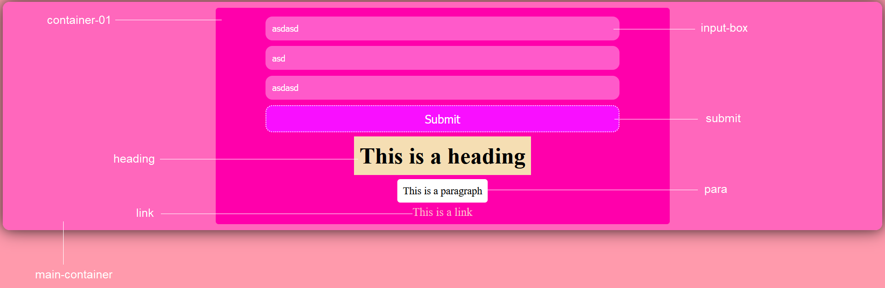

# css-boilerplate
CSS is so cubersome every time you want to pull up a new HTML file. If only you could keep some CSS ready for use. 
___
### Usage

`git clone https://github.com/ayushbasak/css-boilerplate.git`

Choose a Theme from the following:
- menthol-cool
- angry-red

Add these classes to your elements
### features:

- **main-container**:
    Use to contain main body

- **container-01**:
    a secondary div element

- **input-box**:
    for all text inputs

- **para**:
    for paragraph texts

- **link**
    hyperlinks

Add these classes along with any other CSS classes or use it alone

`<input type = "text" class = "[your-css-class-if-any] input-box">`
    